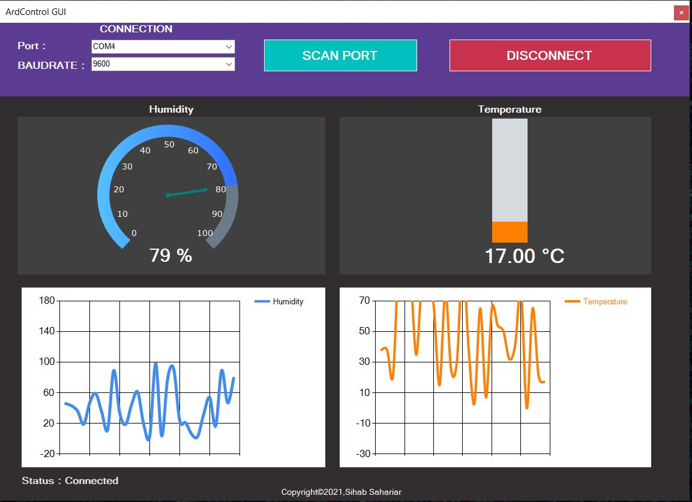

# ArdControl
VB.NET App to scan port, read data(Dummy Temperature, Humidity) from Arduino and plot it on GUI through Circular Progress bar and Charts.
Information:
- Programming Language: VB.NET
- Software: Microsoft Visual Studio 2019
- Framework: GUNA UI

